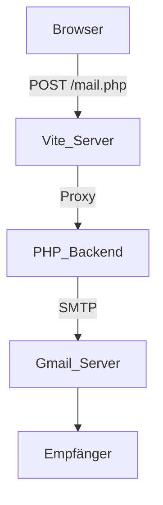

# admin/config.yaml  
Kurztitel: Konfiguration für Netlify CMS im Admin-Bereich.  

Dieses File legt die **Backend-Anbindung**, **Medienpfade** und **Sammlungen** fest. Es steuert, wie und wo Inhalte im Repository gepflegt werden.  

## Backend  
- **name**: GitHub  
- **repo**: Gabriel-Knauder/webshop  
- **branch**: main  

## Medienverwaltung  
- **media_folder**: "assets/images" – Speicherort der hochgeladenen Bilder im Repo  
- **public_folder**: "/assets/images" – öffentlicher Pfad im Web  

## Collections  
Definiert inhaltsbezogene Gruppen für das CMS.  
| name    | label  | files          | fields                                |
|---------|--------|----------------|---------------------------------------|
| pages   | Seiten | index.md (Startseite) | Titel (string), Inhalt (markdown) |

# admin/index.html  
Kurztitel: Einstiegspunkt für das Content-Management.  

Diese HTML-Seite lädt das Netlify-CMS-Script und bindet die obige Konfiguration ein.  

## Aufbau  
- Leerer `<body>` – Netlify CMS rendert hier das UI  
- `<script src="https://unpkg.com/netlify-cms@^2.0.0/dist/netlify-cms.js">` lädt das CMS  

## Zusammenspiel  
- **admin/config.yaml** wird automatisch von Netlify CMS erkannt  
- Ermöglicht das Bearbeiten von Markdown-Dateien im `/admin`-Pfad  

# src/counter.js  
Kurztitel: Zähler-Modul für interaktive Buttons.  

Exportiert eine Funktion, die an ein HTML-Element einen Klick-Listener bindet.  

```js
export function setupCounter(element) {
  let counter = 0
  const setCounter = (count) => {
    counter = count
    element.innerHTML = `count is ${counter}`
  }
  element.addEventListener('click', () => setCounter(counter + 1))
  setCounter(0)
}
```

## Funktionen  
- **setupCounter(element)**  
  - Initialisiert Zähler auf 0  
  - Aktualisiert Text bei Klick  

## Verwendung  
Import in **src/main.js** und Bindung an Button mit `id="counter"`.  

# src/main.js  
Kurztitel: Einstiegspunkt der Vite-App.  

Erzeugt dynamisch den DOM-Inhalt und initialisiert den Zähler.  

```js
import './style.css'
import javascriptLogo from './javascript.svg'
import viteLogo from '/vite.svg'
import { setupCounter } from './counter.js'

document.querySelector('#app').innerHTML = `
  <div>
    <a href="https://vite.dev" ...></a>
    <a href="https://developer.mozilla.org/..." ...></a>
    <h1>Hello Vite!</h1>
    <div class="card">
      <button id="counter" type="button"></button>
    </div>
    <p class="read-the-docs">Click on the Vite logo to learn more</p>
  </div>
`
setupCounter(document.querySelector('#counter'))
```

## Imports  
- **Styling**: `./style.css`  
- **Assets**: Logos als Module  
- **Counter**: `setupCounter` aus `src/counter.js`  

## Ablauf  
1. Rendern des Grundgerüsts in `#app`  
2. Aufruf von `setupCounter`  

# composer.json  
Kurztitel: PHP-Abhängigkeiten via Composer.  

Definiert, welche PHP-Bibliotheken das Projekt benötigt.  

```json
{
  "require": {
    "phpmailer/phpmailer": "^6.10"
  }
}
```

## Abhängigkeiten  
| Paket                  | Version |
|------------------------|---------|
| phpmailer/phpmailer    | ^6.10   |

## Anwendung  
- Erzeugt `vendor/autoload.php`  
- Eingebunden in **mail.php** für E-Mail-Versand  

# index.html  
Kurztitel: Haupt-HTML-Template für die Webshop-Oberfläche.  

Dient als Einstieg im Browser und bindet CSS ein.  

```html
<!DOCTYPE html>
<html lang="en" class="scroll-smooth">
  <head>
    <meta charset="UTF-8" />
    <link rel="icon" href="/vite.svg" />
    <meta name="viewport" content="width=device-width, initial-scale=1.0" />
    <title>My shop</title>
    <link href="/src/style.css" rel="stylesheet" />
  </head>
  <body class="bg-gradient-to-bl ... text-white">
    <!-- Header mit Navigation -->
    <!-- Sektionen: Home, Services, Portfolio, Contact -->
    <!-- Kontaktformular: action="/mail.php" method="POST" -->
  </body>
</html>
```

## Struktur  
- **Header**: fixed, mit Navigationslinks zu Sections  
- **Body**: bunte Farbverläufe, Tailwind-Klassen  
- **Kontakt**: Formular sendet Daten an **mail.php**  

# mail.php  
Kurztitel: PHP-Skript für das Kontaktformular.  

Validiert Eingaben, versendet E-Mails über PHPMailer und zeigt Status im Browser.  

```php
<?php
use PHPMailer\PHPMailer\PHPMailer;
use PHPMailer\PHPMailer\Exception;

require 'vendor/autoload.php';

$success = false;
$error = false;
$message = '';

if ($_SERVER["REQUEST_METHOD"] === "POST") {
    // Felder validieren
    // PHPMailer konfigurieren und senden
    // $success / $error setzen
} else {
    $error = true;
    $message = "Ungültige Anfrage.";
}
?>
<!doctype html>
<html lang="de">
  <head> … </head>
  <body>
    <!-- Ausgabe von $message -->
  </body>
</html>
```

## Ablauf  
- **Validierung** aller Formularfelder  
- **SMTP-Konfiguration** (Gmail-Beispiel)  
  - Host: smtp.gmail.com  
  - TLS, Port 587  
- **E-Mail-Inhalt**: HTML und AltBody  
- **Fehlerbehandlung** mit Exception  

### E-Mail-Fluss  


# package.json  
Kurztitel: Node-Projektkonfiguration.  

Definiert Skripte, Abhängigkeiten und Projektmeta.  

```json
{
  "name": "my-project",
  "private": true,
  "version": "0.0.0",
  "type": "module",
  "scripts": {
    "dev": "vite",
    "build": "vite build",
    "preview": "vite preview"
  },
  "devDependencies": {
    "autoprefixer": "^10.4.21",
    "postcss": "^8.5.6",
    "tailwindcss": "^4.1.13",
    "vite": "^7.1.7"
  },
  "dependencies": {
    "@tailwindcss/vite": "^4.1.13"
  }
}
```

## Skripte  
- **npm run dev**: Entwicklungsmodus mit HMR  
- **npm run build**: Produktions-Bundling  
- **npm run preview**: Vorschau des Builds  

## Abhängigkeiten  
| Paket               | Version    | Typ              |
|---------------------|------------|------------------|
| vite                | ^7.1.7     | devDependency    |
| postcss             | ^8.5.6     | devDependency    |
| autoprefixer        | ^10.4.21   | devDependency    |
| tailwindcss         | ^4.1.13    | devDependency    |
| @tailwindcss/vite   | ^4.1.13    | dependency       |

# tailwind.config.js  
Kurztitel: Tailwind CSS-Anpassung.  

Erweitert das Standard-Theme um Animationen und Keyframes.  

```js
module.exports = {
  theme: {
    extend: {
      animation: {
        fadeInLeft: 'fadeInLeft 1s ease forwards',
        fadeInUp: 'fadeInUp 1s ease forwards',
        pulseSlow: 'pulse 2.5s ease-in-out infinite',
      },
      keyframes: {
        fadeInLeft: { '0%': { opacity: 0, transform: 'translateX(-20px)' }, '100%': { opacity: 1, transform: 'translateX(0)' }},
        fadeInUp:   { '0%': { opacity: 0, transform: 'translateY(20px)' }, '100%': { opacity: 1, transform: 'translateY(0)' }},
      },
    },
  },
  plugins: [],
}
```

## Erweiterungen  
- **Animationsnamen**: fadeInLeft, fadeInUp, pulseSlow  
- **Keyframes**: Animationsabläufe  

# vite.config.js  
Kurztitel: Vite-Server- und Build-Konfiguration.  

Legt Plugins und Dev-Server-Proxy für PHP fest.  

```js
import { defineConfig } from 'vite'
import tailwindcss from '@tailwindcss/vite'

export default defineConfig({
  plugins: [ tailwindcss() ],
  server: {
    proxy: { '/mail.php': 'http://localhost:8000' }
  }
})
```

## Plugins  
- **@tailwindcss/vite**: Integriert Tailwind als Vite-Plugin  

## Dev-Server  
- **Proxy** `/mail.php` → PHP-Backend auf Port 8000  
- Erlaubt Entwicklung ohne CORS-Probleme beim Formularversand
